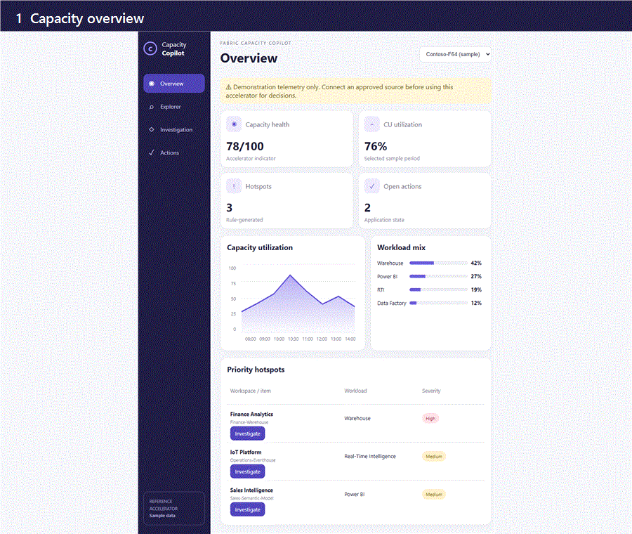
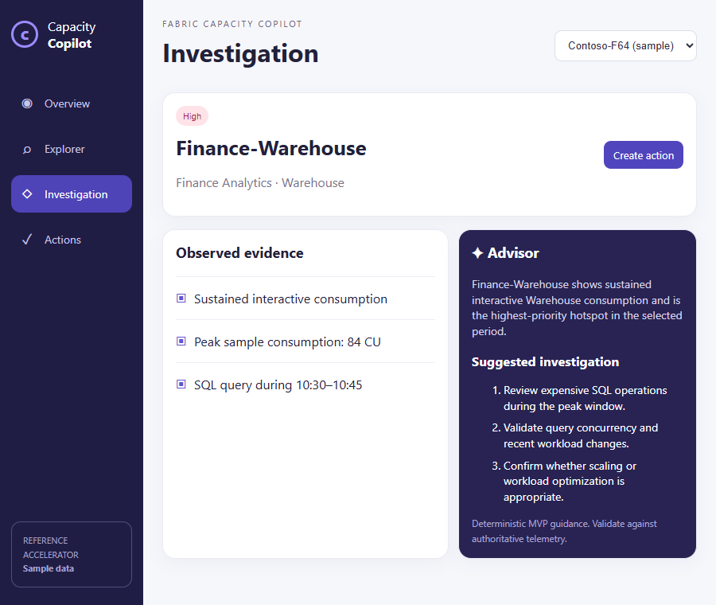
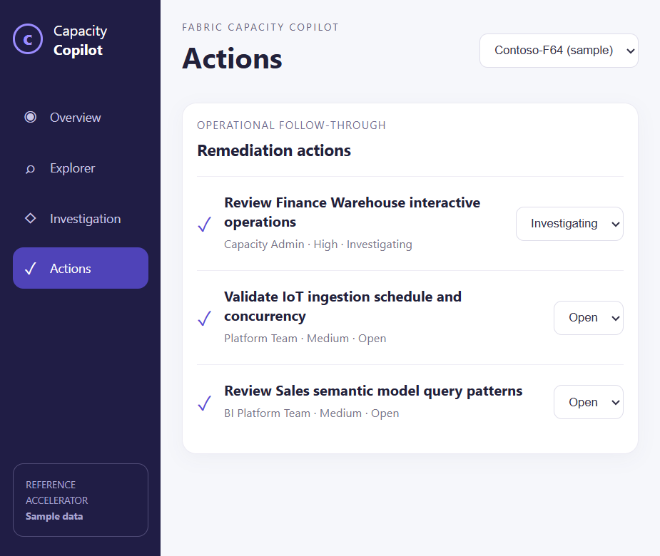
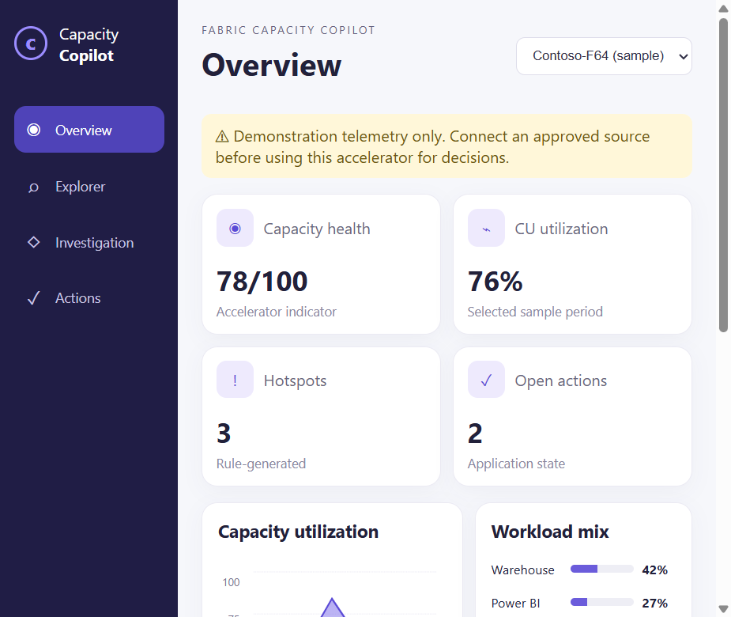
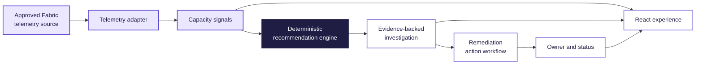

<div align="center">
  

  # Fabric Capacity Copilot

  **Turn Microsoft Fabric capacity telemetry into evidence-backed investigation and accountable remediation.**

  [](https://haroon921.github.io/fabric-capacity-copilot/)
  [](docs/Fabric-Capacity-Copilot-Overview.pptx)

  [](https://github.com/Haroon921/fabric-capacity-copilot/actions/workflows/ci.yml)
  [](https://github.com/Haroon921/fabric-capacity-copilot/actions/workflows/deploy-pages.yml)
  [](https://github.com/Haroon921/fabric-capacity-copilot/actions/workflows/codeql.yml)
  
  
  
</div>



> [!IMPORTANT]
> This repository is an accelerator/reference implementation, not a Microsoft product. The interface uses clearly labelled sample telemetry. Connect an approved source and complete your organization's security, privacy, accessibility, and operational reviews before production use.

## Why it matters

Capacity teams often have the signal but lack a consistent path from telemetry to ownership. This accelerator demonstrates one connected workflow:

| Experience | Outcome |
| --- | --- |
| Executive overview | Understand capacity health, utilization, workload mix, and priority hotspots at a glance. |
| Capacity explorer | Review time-series consumption and narrow the investigation scope. |
| Evidence-backed investigation | Translate a selected hotspot into deterministic guidance grounded in observed signals. |
| Action center | Assign, track, and resolve remediation work without losing operational context. |
| Rayfin data model | Extend investigations, recommendations, and actions into durable application entities. |

## Product experience

<table>
  <tr>
    <td width="50%" valign="top">
      <b>Evidence-backed investigation</b><br><br>
      
    </td>
    <td width="50%" valign="top">
      <b>Operational action center</b><br><br>
      
    </td>
  </tr>
</table>

<details>
  <summary><b>View the complete capacity overview</b></summary>
  <br>
  
</details>

## Architecture



The sample adapter is intentionally separated from the recommendation engine so teams can replace demonstration telemetry without rewriting the investigation experience.

## Run locally

Prerequisites: Node.js 20 or later and npm.

```bash
npm ci
npm run dev
```

Open the local URL shown by Vite. To validate the optimized build:

```bash
npm run build
npm run preview
```

## Explore and extend

- [Live demonstration](https://haroon921.github.io/fabric-capacity-copilot/)
- [Executive presentation](docs/Fabric-Capacity-Copilot-Overview.pptx)
- [Roadmap](ROADMAP.md)
- [Contributing guide](CONTRIBUTING.md)
- [Deployment guide](docs/DEPLOYMENT.md)
- [Data integration guide](docs/DATA-INTEGRATION.md)
- [Security guidance](docs/SECURITY.md)
- [Latest release](https://github.com/Haroon921/fabric-capacity-copilot/releases/latest)

## Technology

React · TypeScript · Vite · Recharts · Lucide · optional Rayfin entities

## License

Licensed under the [MIT License](LICENSE).
